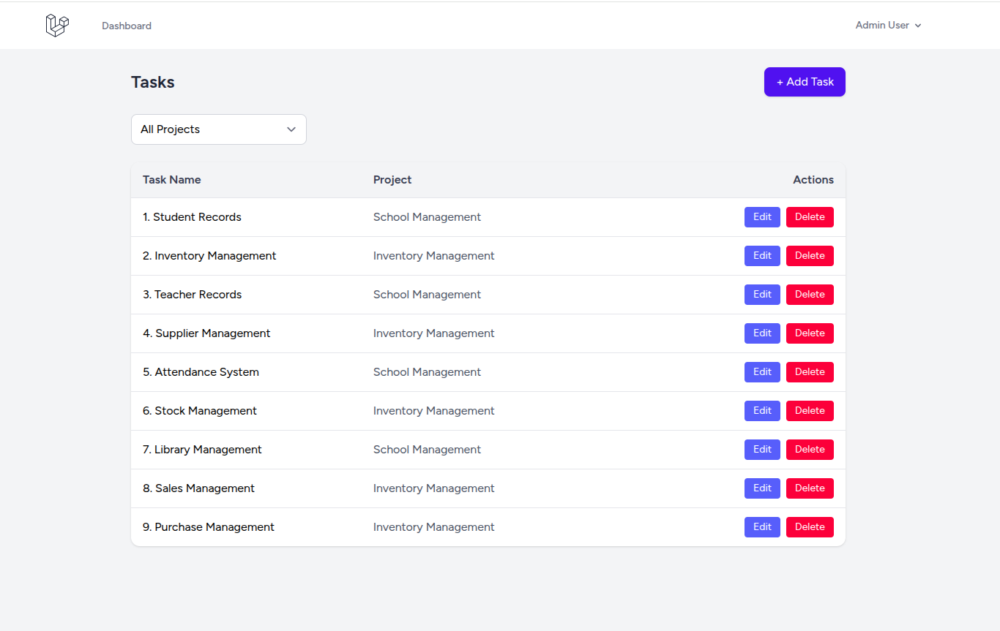
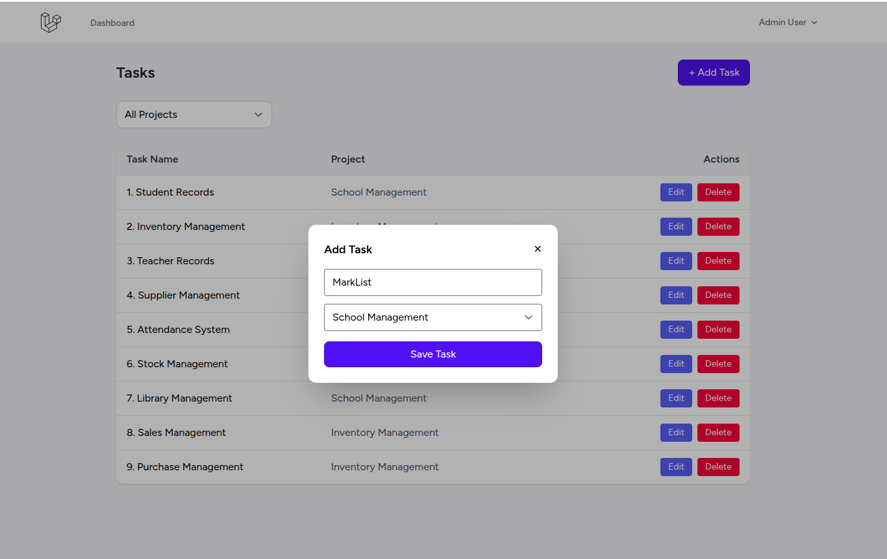
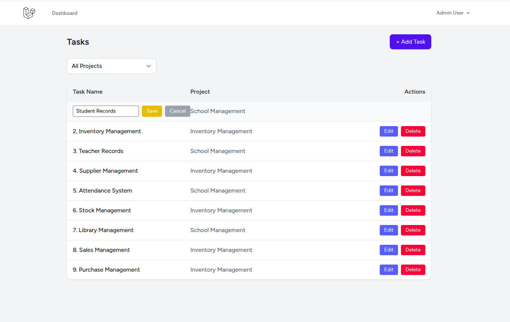

Task Manager App

This is a simple Task Management Web Application built using Laravel.

After logging into the system, users can Add, Edit, and Manage Tasks under different projects. The application includes default seeders that automatically create sample projects such as:


* School Management

* Inventory Management


Additionally, dummy tasks are seeded for demonstration purposes.

Users can:

* Drag and drop tasks to reorder them

* Automatically update task priority based on order

* Filter tasks based on selected criteria


📦 Installation


1️⃣ Clone the Repository
```
git clone https://github.com/pramod-alpy/tak-manager.git
cd task-manager
```
2️⃣ Install PHP Dependencies
```
composer install
```
3️⃣ Install JS Dependencies
```
npm install
```
4️⃣ Copy .env File
```
cp .env.example .env
```
5️⃣ Generate App Key
```
php artisan key:generate
```
6️⃣ Configure Database in .env
```
DB_CONNECTION=mysql
DB_HOST=localhost
DB_PORT=3306
DB_DATABASE=task_manager
DB_USERNAME=root
DB_PASSWORD=
```
8️⃣ Run Migrations

```
php artisan migrate
```
9️⃣ Run Seeders
```
php artisan db:seed
```
🔟 Start Development Servers

Backend
```
php artisan serve

```
Frontend
```
npm run dev

```

⚙️ Tech Stack

* Backend: Laravel, MySQL

* Frontend: Blade Templetes

* Other: Composer, npm


✨ Screenshots

Task List Page



Add Task



Edit Task



